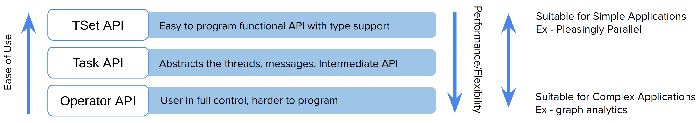

# Programming API's

Twister2 provides three levels of programming at this level. These APIs allow users to program 
a distributed application according to the level of usability and performance needed.

 

This fact is summarized in the following figure.



## Operator API

This is the lowest level of API provided by Twister2. It provides the basic parallel operators required
by a parallel programs in terms of both Bulk Synchronous Parallel (BSP) and DataFlow API. 

The BSP APIs are provided by Harp and MPI specification (OpenMPI).

The DataFlow operators are implemented by Twister2 as a Twister:Net library. 

## Task API

The Task API is the middle tier API that provides both flexibility and performance. A user directly
models an application as a graph and program it using the Task Graph API.  

```java
  @Override
  public void execute() {
    // source and aggregator
    WordSource source = new WordSource();
    WordAggregator counter = new WordAggregator();

    // build the task graph
    TaskGraphBuilder builder = TaskGraphBuilder.newBuilder(config);
    builder.addSource("word-source", source, 4);
    builder.addSink("word-aggregator", counter, 4).keyedReduce("word-source", EDGE,
        new ReduceFn(Op.SUM, DataType.INTEGER), DataType.OBJECT, DataType.INTEGER);
    builder.setMode(OperationMode.BATCH);

    // execute the graph
    DataFlowTaskGraph graph = builder.build();
    ExecutionPlan plan = taskExecutor.plan(graph);
    taskExecutor.execute(graph, plan);
  }

```

## TSet API

The TSet API is similar to Spark RDD, Flink DataSet or Heron Streamlet APIs. It provides a typed 
functional style API for programming a distributed application. The user program is written as a 
set of data transformation steps. 


```java
  @Override
  public void execute(TwisterBatchContext tc) {
    // set the parallelism of source to task stage 0
    List<Integer> taskStages = jobParameters.getTaskStages();
    int sourceParallelism = taskStages.get(0);
    int sinkParallelism = taskStages.get(1);
    SourceTSet<int[]> source = tc.createSource(new TestBaseSource(),
        sourceParallelism).setName("Source");
    ReduceTLink<int[]> reduce = source.reduce((t1, t2) -> {
      int[] val = new int[t1.length];
      for (int i = 0; i < t1.length; i++) {
        val[i] = t1[i] + t2[i];
      }
      return val;
    });

    reduce.sink(value -> {
      experimentData.setOutput(value);
      LOG.info("Result : " + Arrays.toString(value));
      try {
        verify(OperationNames.REDUCE);
      } catch (VerificationException e) {
        LOG.info("Exception Message : " + e.getMessage());
      }
      return true;
    });
  }
```
