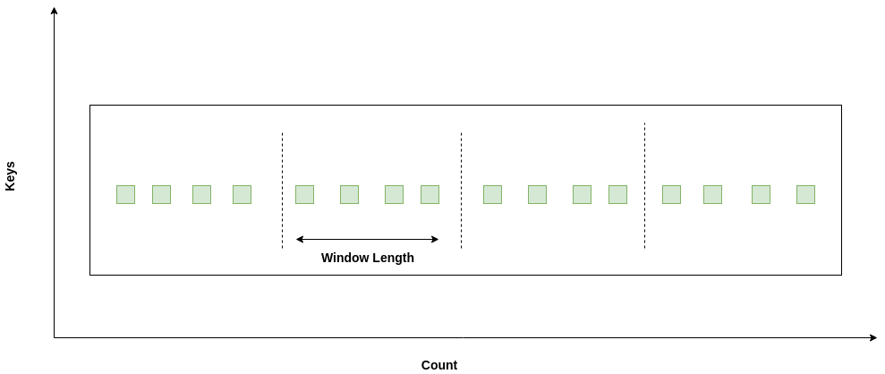
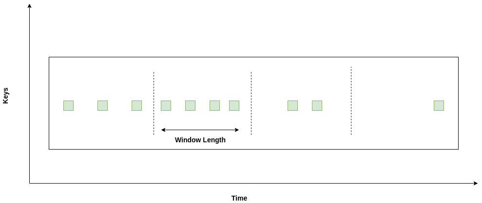
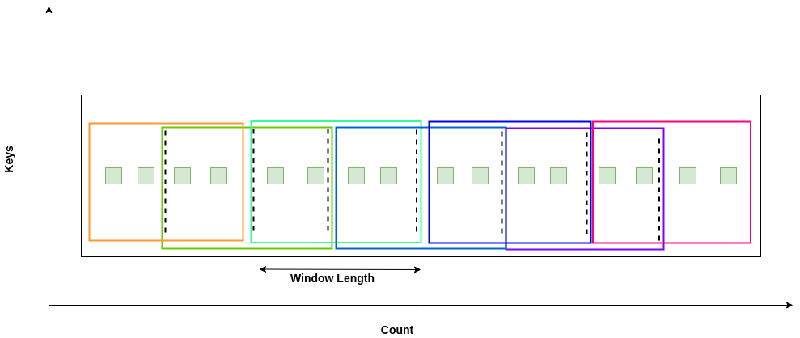

# Windowing

Twister2 Streaming API supports the discretization of a data stream via windowing.
Our Windowing API was developed supporting functionalities in Apache Storm and Apache Flink. 
The core API has inherent features of Apache Storm API. Our windowing API definitions are
derived from the industry standards maintained by Apache Storm and Apache Flink APIs.
The windowing categorization can be found in the following figure. In streaming engines like 
Apache Flink, the key based and non-key based support is discussed for windowing, but in Twister2
we have inbuilt communication functions built for keyed and non-keyed operations. So when user is 
creating a workflow, it can be created using keyed or non-keyed streaming pipelines. 

  

---
**NOTE**

The gray colored boxes with Global and Session Window support is not yet provided in Twister2.

---

## Window Types

### Tumbling 

Tumbling windowing is a fixed size window where the elements belonging to a particular 
window only belong to that window only. There is no repetition of these elements. This is 
also known as fixed windows.  

For example, you can say you need to collect 4 elements per window and this can be a window
based on the number of elements per window.  

   

```java
    BaseWindowedSink dw = new DirectWindowedReceivingTask()
        .withTumblingCountWindow(4);
```

The other way is that you can say, you need to collect some elements per every 2 minutes.



```java
    BaseWindowedSink dwDuration = new DirectWindowedReceivingTask()
        .withTumblingDurationWindow(2, TimeUnit.MINUTES);

```

These are the ways that you can create a tumbling window, based on time and based on the count. 

### Sliding 

Sliding window has two properties, sliding length and window length. Sliding length can be lesser 
than the window length. This can be present in terms of both count and duration. 

For example, you can say you need to collect 4 elements per window and this can be a window
based on the number of elements per window.  

   

```java
BaseWindowedSink sdw = new DirectWindowedReceivingTask()
        .withSlidingCountWindow(4, 2);

```

The other way is that you can say, you need to collect some elements per every 2 minutes.


```java
    BaseWindowedSink sdwDuration = new DirectWindowedReceivingTask()
        .withSlidingDurationWindow(4, TimeUnit.MINUTES,
            2, TimeUnit.MINUTES);
```


### Session

A session window is defined as a window where a presense of an element triggers the window starting, 
but the windowing period terminates after a time out. Currently Twister2 doesn't support this 
function, but it will be added to the next release. 

### Global

Global window is a definition coming in Apache Flink windowing APIs. It provides the ability to 
get same keyed elements to the same window. Twister2 inherent communication APIs can already support
this. You can design your task graph with the specific key selectors to get this done. 
But in an upcoming release, Twister2 will provide a programming abstraction at the windowing level
for users to handle this in another way. 

---
**NOTE**

1. Tumbling window is a special instance of a sliding window where the sliding length equals to window
length. 
2. Duration windowing can have windows with no elements, in processing, the filtering functions can 
be used to avoid issues in calculations or we can design custom policies to manage it. This will be
further discussed in Windowing policies, eviction policies and strategy sections. 

---

## Windowing Policies

Windowing Policies are basically designed to create a dynamic design pattern to provide custom
policy addition capability. For these policy definitions Twister2 uses Apache Storm windowing policy
definitions to support windowing. Windowing policy decides how the boundary of the window is identified
by means of the elements for count based and in terms of watermark or timer for duration based
windows. These are the main types of windowing policies we supports. 

1. Count Windowing Policy
2. Duration Windowing Policy
3. Watermark Count Windowing Policy
4. Watermark Duration Windowing Policy


## Eviction Policies

Eviction policy provides support to the windowing policy to identify the boundary specially for the
duration based and watermark based policies. 

1. Count Eviction Policy
2. Duration Eviction Policy
3. Watermark Count Eviction Policy
4. Watermark Duration Eviction Policy


## Windowing Strategy

Windowing strategy is an abstraction layer of Eviction and Windowing policies where user can 
create custom strategies to design a windowing mechanism. Currently, Twister2 supports the following
strategies. 

1. Tumbling Count Window Strategy
2. Tumbling Duration Window Strategy
3. Sliding Count Window Strategy
4. Sliding Duration Window Strategy


## Window Function

Windowing functionality is a function provided for the user to design their programming logic 
which has to be executed on the window. We followed the standards defined in Apache Flink to provide
similar functionalities. 

### Reduce Function

User can design a custom reduce function on top of the window and the logic defined in the reduce
function will be applied on the elements inside the window. 

```java
protected static class DirectReduceWindowedTask extends ReduceWindow<int[]> {


    public DirectReduceWindowedTask(ReduceWindowedFunction<int[]> reduceWindowedFunction) {
      super(reduceWindowedFunction);
    }

    @Override
    public boolean reduce(int[] content) {
      LOG.info("Window Reduced Value : " + Arrays.toString(content));
      return true;
    }

    @Override
    public boolean reduceLateMessage(int[] content) {
      return false;
    }

  }
```

```java
protected static class ReduceFunctionImpl implements ReduceWindowedFunction<int[]> {

    @Override
    public int[] onMessage(int[] object1, int[] object2) {
      int[] ans = new int[object1.length];
      for (int i = 0; i < object1.length; i++) {
        ans[i] = object1[i] + object2[i];
      }
      return ans;
    }

    @Override
    public int[] reduceLateMessage(int[] lateMessage) {
      return new int[0];
    }
  }
```

```java
BaseWindowedSink sdwCountTumblingReduce = new DirectReduceWindowedTask(new ReduceFunctionImpl())
        .withTumblingCountWindow(5);
```


### Aggregation Function

Aggregation of windowed values is another functionality user needs when processing the window. 

```java
 protected static class DirectAggregateWindowedTask extends AggregateWindow<int[]> {

    public DirectAggregateWindowedTask(AggregateWindowedFunction aggregateWindowedFunction) {
      super(aggregateWindowedFunction);
    }

    @Override
    public boolean aggregate(int[] message) {
      LOG.info("Window Aggregate Value : " + Arrays.toString(message));
      return true;
    }

    @Override
    public boolean aggregateLateMessages(int[] message) {
      LOG.info(String.format("Late Aggregate Message : %s", Arrays.toString(message)));
      return true;
    }
  }
```


```java
protected static class AggregateFunctionImpl implements AggregateWindowedFunction<int[]> {

    private int weight1;

    private int weight2;

    public AggregateFunctionImpl(int weight1, int weight2) {
      this.weight1 = weight1;
      this.weight2 = weight2;
    }

    @Override
    public int[] onMessage(int[] object1, int[] object2) {
      int[] ans = new int[object1.length];
      for (int i = 0; i < object1.length; i++) {
        ans[i] = this.weight1 * object1[i] + this.weight2 * object2[i];
      }
      return ans;
    }
  }
```

```java
BaseWindowedSink sdwCountTumblingAggregate
        = new STWindowExample
        .DirectAggregateWindowedTask(new AggregateFunctionImpl(1, 2))
        .withTumblingCountWindow(5);
```

### Fold Function

Fold function provides the user the ability to get a different data typed or same data typed
output from the data type in the window. This is more likely to help in creating summaries or
creating and output to support a different function or API which needs a different data type. 

```java
protected static class DirectFoldWindowedTask extends FoldWindow<int[], String> {

    public DirectFoldWindowedTask(FoldWindowedFunction<int[], String> foldWindowedFunction) {
      super(foldWindowedFunction);
    }

    @Override
    public boolean fold(String content) {
      LOG.info("Window Fold Value : " + content);
      return true;
    }

    @Override
    public boolean foldLateMessage(String lateMessage) {
      LOG.info(String.format("Late Aggregate Message : %s", lateMessage));
      return false;
    }
  }

```

```java
protected static class DirectFoldWindowedTask extends FoldWindow<int[], String> {

    public DirectFoldWindowedTask(FoldWindowedFunction<int[], String> foldWindowedFunction) {
      super(foldWindowedFunction);
    }

    @Override
    public boolean fold(String content) {
      LOG.info("Window Fold Value : " + content);
      return true;
    }

    @Override
    public boolean foldLateMessage(String lateMessage) {
      LOG.info(String.format("Late Aggregate Message : %s", lateMessage));
      return false;
    }
  }
```

```java
BaseWindowedSink sdwCountTumblingFold = new DirectFoldWindowedTask(new FoldFunctionImpl())
        .withTumblingCountWindow(5);

```

### Window Process Function

Process function provides you the ability to get the same elements of the window, but you can 
apply a custom function on each element. This is also a different use case that use may need when
providing data to different APIs. 

```java
protected static class DirectProcessWindowedTask extends ProcessWindow<int[]> {

    public DirectProcessWindowedTask(ProcessWindowedFunction<int[]> processWindowedFunction) {
      super(processWindowedFunction);
    }

    @Override
    public boolean process(IWindowMessage<int[]> windowMessage) {
      for (IMessage<int[]> msg : windowMessage.getWindow()) {
        int[] msgC = msg.getContent();
        LOG.info("Process Window Value : " + Arrays.toString(msgC));
      }
      return true;
    }

    @Override
    public boolean processLateMessages(IMessage<int[]> lateMessage) {
      LOG.info(String.format("Late Message : %s",
          lateMessage.getContent() != null ? Arrays.toString(lateMessage.getContent()) : "null"));
      return true;
    }
  }
```

```java
 protected static class ProcessFunctionImpl implements ProcessWindowedFunction<int[]> {

    @Override
    public IWindowMessage<int[]> process(IWindowMessage<int[]> windowMessage) {
      int[] current = null;
      List<IMessage<int[]>> messages = new ArrayList<>(windowMessage.getWindow().size());
      for (IMessage<int[]> msg : windowMessage.getWindow()) {
        int[] value = msg.getContent();
        if (current == null) {
          current = value;
        } else {
          current = add(current, value);
          messages.add(new TaskMessage<>(current));
        }

      }
      WindowMessageImpl<int[]> windowMessage1 = new WindowMessageImpl<>(messages);
      return windowMessage1;
    }

    @Override
    public IMessage<int[]> processLateMessage(IMessage<int[]> lateMessage) {
      int[] res = lateMessage.getContent();
      if (res != null) {
        for (int i = 0; i < res.length; i++) {
          res[i] = res[i];
        }
      }
      return new TaskMessage<>(res);
    }

    @Override
    public int[] onMessage(int[] object1, int[] object2) {
      if (object1 != null && object2 != null) {
        return add(object1, object2);
      }
      return null;
    }

    private int[] add(int[] a1, int[] a2) {
      int[] ans = new int[a1.length];
      for (int i = 0; i < a1.length; i++) {
        ans[i] = a1[i] + a2[i];
      }
      return ans;
    }
  }
```

```java
BaseWindowedSink sdwCountTumblingProcess
        = new DirectProcessWindowedTask(new ProcessFunctionImpl())
        .withSlidingDurationWindow(5, TimeUnit.MILLISECONDS, 3,
            TimeUnit.MILLISECONDS);
```

## Late Stream Processing

For the late elements which are coming in the stream, Twister2 currently provides a separate function
call which is being called once a late element is coming via the stream. For all the functions defined
in the previous section a late message call is provided. 

```java
@Override
    public boolean processLateMessages(IMessage<int[]> lateMessage) {
      LOG.info(String.format("Late Message : %s",
          lateMessage.getContent() != null ? Arrays.toString(lateMessage.getContent()) : "null"));
      return true;
    }
```

Here  you can design your logic to process a late arriving element. 

### Late Stream

Twister2 will provide a late stream in an upcoming release to link this late coming data to a batch 
layer so that the accuracy of the system can be improved. 

## Future Implementations

1. Global windowing
2. Session windowing
3. Late Stream


