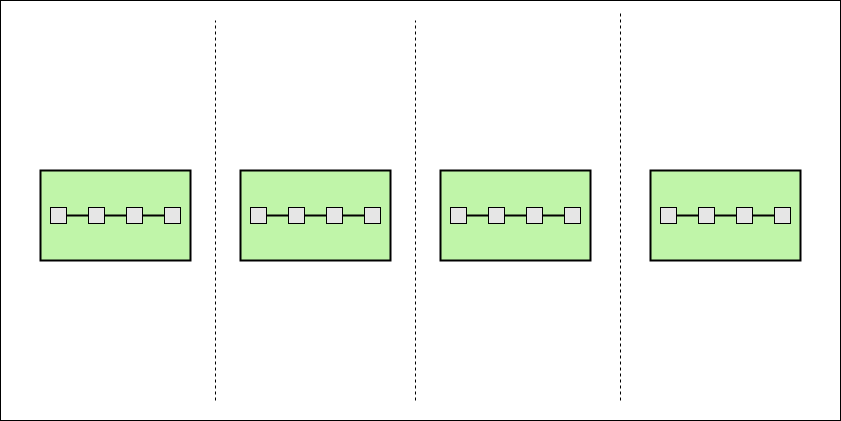

# Windowing Support

Twister2 Streaming API supports the discretization of a data stream via windowing.
Our Windowing API was developed supporting functionalities in Apache Storm and Apache Flink. 
The core API has inherent features of Apache Storm API. Our windowing API definitions are
derived from the industry standards maintained by Apache Storm and Apache Flink APIs.
The windowing categorization can be found in the following figure. 

  

---
**NOTE**

The gray colored boxes with Global and Session Window support is not yet provided in Twister2.

---

## Window Types

### Tumbling 

Tumbling windowing is a fixed size window where the elements belonging to a particular 
window only belong to that window only. There is no repetition of these elements. This is 
also known as fixed windows. 

For example, you can say you need to collect 5 elements per window and this can be a window
based on the number of elements per window. The other way is that you can say, you need to 
collect some elements per every 2 minutes. These are the ways that you can create a tumbling 
window, based on time and based on the count. 

   

### Sliding 
### Session
### Global

## Windowing Policies

### Count Windowing Policy
### Duration Windowing Policy
### Watermark Count Windowing Policy
### Watermark Duration Windowing Policy

## Eviction Policies

### Count Eviction Policy
### Duration Eviction Policy
### Watermark Count Eviction Policy
### Watermark Duration Eviction Policy

## Windowing Strategy

### Tumbling Count Window Strategy
### Tumbling Duration Window Strategy
### Sliding Count Window Strategy
### Sliding Duration Window Strategy

## Window Function

### Reduce Function

### Aggregation Function

### Fold Function

### Window Process Function

## Late Stream Processing

### Function call 

### Late Stream

## Future Implementations

### Session Window

### Global Window

