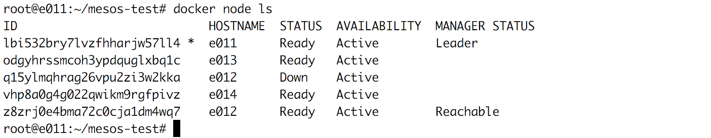
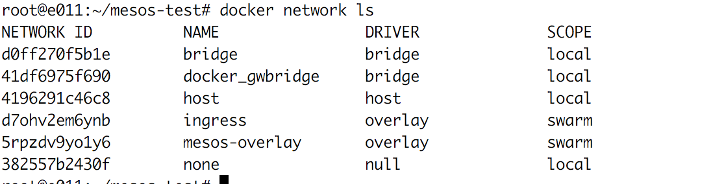

**Twister2 Mesos Installation**

In order to use Mesos, you have to install it on the machines that you
want to use. One of the nodes will be the Mesos master and the others
will be Mesos agents. In order to run Mesos in your cluster, you need to
have Zookeeper running somewhere. Please refer to Mesos and Zookeeper
webpages for more information on installing them.

To install Twister2 on a machine, please follow the steps
in [installation
document](https://github.com/DSC-SPIDAL/twister2/blob/master/docs/deployment/installation.md).
To compile the project follow the instructions to the [compilation
document](https://github.com/DSC-SPIDAL/twister2/blob/master/docs/deployment/compiling.md).
You may also check [developer
document](https://github.com/DSC-SPIDAL/twister2/blob/master/docs/developers/developer-environment.md) for
setting up IDEs.

Here are the few things you need to do to run Twister2 jobs on Mesos
clusters.

**Persistent Storage Settings**

Twister2 expects that either a Persistent Storage Provisioner or
statically configured PersistentVolume exists in the cluster.  Our Mesos
system uses NFS for persistent storage to store logs and outputs of
twister2 jobs.

We tested with NFS-Client provisioner
from: [\[https://github.com/kubernetes-incubator/external-storage/tree/master/nfs-client\]{.underline}](https://github.com/kubernetes-incubator/external-storage/tree/master/nfs-client)

NFS-Client provisioner is used if you already have an NFS server.
Otherwise you may use the NFS provisioner that does not require to have
an NFS
server: [\[https://github.com/kubernetes-incubator/external-storage/tree/master/nfs\]{.underline}](https://github.com/kubernetes-incubator/external-storage/tree/master/nfs)

You have to set the following parameters in client.yaml config file in
order to use NFS.

    # nfs server address
    nfs.server.address: "149.165.150.81"

    # nfs server path
    nfs.server.path: "/nfs/shared-mesos/twister2"

**Job Package Uploader Settings**

When users submit a job to Mesos master, they first need to transfer the
job package to workers. Submitting client packs all job related files
into a tar file. This archive files needs to be transferred to each
worker that will be started. This transfer is done through a web server
in Mesos.

To do this there should be a web server running in the cluster. In
addition, job submitting client must have write permission to that
directory. Workers download the job package from this web server. You
need to specify the web server directory and address information
the uploader.yaml file.

    # the directory where the file will be uploaded, make sure the user has the necessary permissions
    # to upload the file here.
    twister2.uploader.directory: "/var/www/html/twister2/mesos/"
    twister2.uploader.directory.repository: "/var/www/html/twister2/mesos/"
    # This is the scp command options that will be used by the uploader, this can be used to
    # specify custom options such as the location of ssh keys.
    twister2.uploader.scp.command.options: "--chmod=+rwx"
    # The scp connection string sets the remote user name and host used by the uploader.
    twister2.uploader.scp.command.connection: "root@149.165.150.81"
    # The ssh command options that will be used when connecting to the uploading host to execute
    # command such as delete files, make directories.
    twister2.uploader.ssh.command.options: ""
    # The ssh connection string sets the remote user name and host used by the uploader.
    twister2.uploader.ssh.command.connection: "root@149.165.150.81"

**Enabling Docker Support**

You need to enable Docker support on Mesos to use this container. Run
the following command to enable Docker support on agents.

    sh -c "echo 'docker,mesos' > /etc/mesos-slave/containerizers"

**Docker setup **

    sudo apt-get install \
        apt-transport-https \
        ca-certificates \
        curl \
        software-properties-common

    curl -fsSL https://download.docker.com/linux/ubuntu/gpg | sudo apt-key add -
    sudo add-apt-repository \
       "deb [arch=amd64] https://download.docker.com/linux/ubuntu \
       $(lsb_release -cs) \
       stable"
    sudo apt-get update
    sudo apt-get install docker-ce

The following is an example init file for the Docker container.

    cd twister2
    wget 149.165.150.81:8082/twister2/mesos/twister2-core.tar.gz
    wget 149.165.150.81:8082/twister2/mesos/twister2-job.tar.gz

    echo "starting sshd"
    /usr/sbin/sshd -D &

    if [ ! -f twister2-core.tar.gz ]; then 
        echo "file not found. Probably could not download the file"
    else
        tar xvf twister2-core.tar.gz
        tar xvf twister2-job.tar.gz
        echo "files fetched and unpacked"
        java -cp twister2-core/lib/*:twister2-job/libexamples-java.jar:/customJars/* $CLASS_NAME
    fi

    sleep infinity
    return_code=$?

    echo -n "$return_code" > /dev/termination-log
    exit $return_code

**Docker Swarm Installation**

Make sure the Docker Engine daemon is started on the host machines.

Open a terminal and ssh into the machine where you want to run your
manager node. This tutorial uses a machine named manager1. If you use
Docker Machine, you can connect to it via SSH using the following
command:

`$ docker-machine ssh manager1`

Run the following command to create a new swarm:

`docker swarm init --advertise-addr <MANAGER-IP>`

**Note:** If you are using Docker for Mac or Docker for Windows to test
single-node swarm, simply run docker swarm init with no arguments. There
is no need to specify --advertise-addr in this case.

The following command creates a swarm on the manager1 machine:

`$ docker swarm init --advertise-addr 192.168.99.100`

Swarm initialized: current node (dxn1zf6l61qsb1josjja83ngz) is now a
manager.

To add a worker to this swarm, run the following command:

    docker swarm join \
        --token SWMTKN-1-49nj1cmql0jkz5s954yi3oex3nedyz0fb0xx14ie39trti4wxv-8vxv8rssmk743ojnwacrr2e7c \
        192.168.99.100:2377

To add a manager to this swarm, run \\'docker swarm join-token manager\\'
and follow the instructions.

To check joined node:

`docker node ls`

**Creating Overlay Network on Docker Swarm**

To create an overlay network on Swarm, following command should be
runned on swarm master.

`docker network create -d overlay --attachable <network-name>`

To see Docker networks:

`docker network ls`

