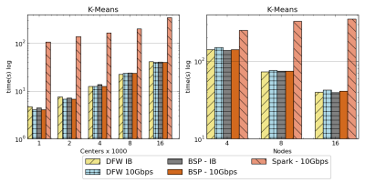

Twister2 is a big data environment for streaming, data processing, and analytics. The system is built around a set of core components realizing the needs of different computing requirements. These components include a resource provisioning layer to interface with cluster resource managers, parallel communication operator layers recognizing the need for both data operators and bulk synchronous parallel (BSP) operators, task system for abstracting out computations and data representation for data manipulation. 

Twister2 is in Alpha stage and we believe with the July release it will move onto the Beta stage. 

## Core Components

Twister2 consists of several core components that provide the essential features of a data analytics platform.

### Resource provisioning component to bring up and manage parallel workers in cluster environments

The primary responsibility of this component is job submission and management. It provides abstractions 
to acquire resources and manage the life cycle of a parallel job. We have developed links to the 
following resource managers and would like to add others such as Yarn, Marathon in the future.

  1. Standalone
  2. Kubernetes
  3. Mesos
  4. Slurm
  5. Nomad
  
Twister2 jobs run in isolation without sharing any resources among jobs. Unlike in other big data 
systems such as Spark or Flink, Twister2 can be running in HPC or cloud environments.

### Parallel and Distributed communication operators 

Unlike other big data analytics systems, we recognize the importance of network communication 
operators for parallel applications and provide a set of abstractions and implementation that 
satisfy the needs of different applications. Both streaming operators and batch operators are provided. 
Three types of operator implementations are provided to the user.  

  1. Twister:Net - a data level dataflow operator library for streaming and large scale batch analysis
  2. Harp - a BSP (Bulk Synchronous Processing) innovative collective framework for parallel applications and machine learning at the message level
  3. OpenMPI (HPC Environments only) at the message level
  
In other big data systems, communication operators are hidden behind high-level APIs. This design 
gives a priority to operator API’s and allows the development of different methods to optimize the 
performance while users can use low-level APIs to program high-performance applications. Twister:Net 
can use both socket based or MPI based (ISent/IRecv) to communicate allowing it to perform well on advanced hardware.

### Task System
This component provides the abstractions to hide the execution details and an easy to program API for parallel applications. A user can create a streaming task graph or a batch task graph to analyze data. The abstractions have similarities to Storm and Hadoop APIs. Task system consists of the following major components.

Task Graph - Create dataflow graphs for streaming and batch analysis including iterative computations
Task Scheduler - Schedule the task graph into cluster resources supporting different scheduling algorithms
Executor - Batch and streaming executions

In Spark and Flink, this component is hidden from the user. Apache Storm and Flink API’s are at this level of abstraction. We allow pluggable executors and task schedulers to extend the capabilities of the system.
  
### Distributed Data Abstraction

A typed distributed data abstraction, similar to Spark RDD, BEAM PCollections or Heron Streamlet is provided here. It can be used to program a data pipeline, a streaming application or iterative application.

  1. Iterative computations
  2. Streaming computations
  3. Data pipelines

In Twister2, iterations (for loops) are carried on each worker. Spark uses a central driver to control the iterations, which can lead to poor performance for applications with frequent iterations (less computation in an iteration). Flink uses the task graph itself to code the iterations (cyclic graphs) and doesn’t support nested iterations.

Data pipelines in Twister2 are similar to Flink or Spark. Twister2 is a pure streaming engine making it similar to Flink or Storm (not a minibatch system like Spark).

### Auxiliary Components

Apart from the main futures, it provides the following components.

  1. Web UI for monitoring Jobs
  2. Connected DataFlow (Experimental), this is for workflow type jobs
  3. Data access API for connecting to different data sources (File systems)

## APIs

Twister2 supports several APIs for programming an application. An application can use a mixed set of these APIs. The main APIs include

1. TSet API (Similar to Spark).
2. Task Graph-based API (Similar to Hadoop and Storm)
3. Communications Operator API (BSP API and DataFlow operator API)
 
Twister2 supports the Storm API for programming a Storm application. The Twister2 native streaming API provides a richer set of operations than Storm API.

## High performance communication layer

Because of the bottom up approach taken when designing and implementing Twister2 the communication 
layer performs extremely well. A complete study on the Twister2 communication layer can be found at
[Twister2:Net](https://www.computer.org/csdl/proceedings/cloud/2018/7235/00/723501a383-abs.html). 

The image below which is extracted from [Twister2:Net](https://www.computer.org/csdl/proceedings/cloud/2018/7235/00/723501a383-abs.html) shows how
Twister2 performs against Apache Spark and MPI. Please note that Spark KMeans example is written using the data level API 
while Twister2 and MPI implementations are communication level applications. However it is clear that Twister2 performs on the same
level as OpenMPI which is an highly optimized communication library in the HPC world. And it out performs Spark by roughly a factor of x10.

Notation :   
`DFW` refers to Twister2  
`BSP` refers to MPI (OpenMPI)  

## Road map

We have started working on our next major release that will connect the core components we have developed 
into a full data analytics environment. In particular it will focus on providing APIs around the core
capabilities of Twister2 and integration of applications in a single dataflow. 

## Next release (July 2019)

1. Connected DataFlow
2. Fault tolerance (completed)
3. Supporting more API's including Beam  
5. More example applications

## Beyond next release

1. Implementing core parts of Twister2 with C/C++ for high performance 
2. Python API
3. Direct use of RDMA
4. SQL interface 
5. Native MPI support for cloud deployments

## Important Links

Harp is a separate project and its documentation can be found in [website](https://dsc-spidal.github.io/harp/)

We use OpenMPI for HP communications [OpenMPI](https://www.open-mpi.org/)
  
Twister2 started as a research project at Indiana University [Digital Science Center](https://www.dsc.soic.indiana.edu/).

## License

Licensed under the Apache License, Version 2.0: http://www.apache.org/licenses/LICENSE-2.0

## Acknowledgements

This work was partially supported by NSF CIF21 DIBBS 1443054 and the Indiana University Precision Health initiative.
We thank Intel for their support of the Juliet and Victor systems and extend our gratitude to the FutureSystems team for their support with the infrastructure.
