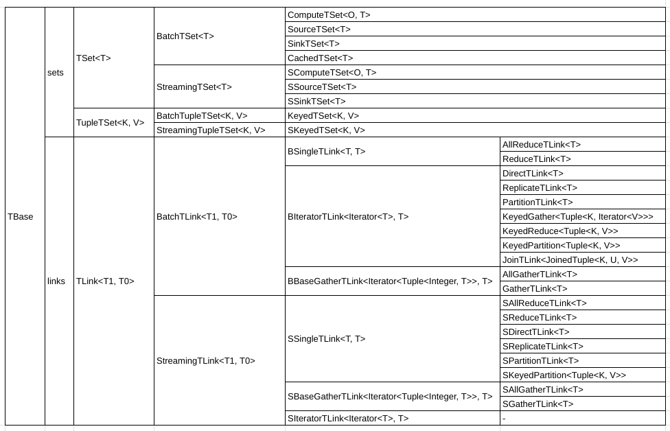

TSets provides a convenient API for functional style distributed application programming in Twister2. 
TSets is a simplified abstraction to```Task API```. Its functionality is similar to Spark API, Flink 
API or Heron Streamlet APIs. 

The user program is written as a set of data transformation steps/ data flow. 
This Dataflow would typically be a DAG (Directed Acyclic Graph). In the backend, user program is 
translated to Task API Task Graph. 

## Example TSet Program

Here is an example TSet program. We would start off with a ```BatchTSetIWorker``` class which 
provides us a```BatchTSetEnvironment``` environment. And then we can create a source, 
transformations and finally a sink.

```java
public class ExampleTSet implements BatchTSetIWorker, Serializable {
  @Override
  public void execute(BatchTSetEnvironment env) {  
    SourceTSet<Integer> source = env.createSource(new TestBaseSource(), 4).setName("Source");
    ReduceTLink<Integer> reduce = source.reduce(Integer::sum);

    reduce.forEach(i -> LOG.info("result: " + i));
  }
}
```

TSets are executed lazily. Once an action such as *TSet.forEach(...)* is called, the underlying 
Dataflow graph will be created and executed based on the TSet execution chain. 

Following are the important aspects of TSets. 
1. Operation Modes 
2. TSetIWorker
3. TSetEnvironment 
4. TSets and TLinks
5. Twister2 Communication IMessage content types 
5. TSetGraph 
6. TSetOps 
7. TSetFunctions

## Operation Modes 
As in the, ```Task API``` there are two operation modes. 
1. Batch mode 
2. Streaming mode 

Users can choose the operation mode by extending the corresponding TSetIWorker. At the moment, batch 
and streaming modes can not be used together in a single IWorker. 

## TSetIWorker
TSetIWorker is an extension of the IWorker interface that would be used in the TSet API. There are 
two interfaces corresponding to the Operation Modes. 
### BatchTSetIWorker
```java
public interface BatchTSetIWorker extends IWorker {

  void execute(BatchTSetEnvironment env);
}
```

### StreamingTSetIWorker
```java
public interface StreamingTSetIWorker extends IWorker {

  void buildGraph(StreamingTSetEnvironment env);
}
```
## TSetEnvironment 
TSetEnvironment provides the entry point to the TSet API. 

It can be used to,
- access the ```WorkerEnvironment``` object for configurations and worker information
- create Sources (Batch/ Streaming)
- access the ```TSetGraph```
- execute/ run TSetGraph explicitly using,  
```java 
    public void run()
``` 
- add inputs to the execution

```BatchTSetEnvironment``` provides following additional methods for execution
- run a particular subgraph from the TSetGraph by 
```java
  public void run(BaseTSet leafTset)
```
- run a particular subgraph from the TSetGraph and output the results as a ```DataObject``` 
```java
public <T> DataObject<T> runAndGet(BaseTSet leafTset)
```

## TSets 
This is the data abstraction which executes an operation on certain chunk of data. 

There are two main distinctions,
- TSets - Used for homogeneously typed data 
- TupleTSets - Used for keyed data 

Each TSet is divided into Batch and Streaming to closely reflect Twister2 Communication semantics.  

## TLink 
This is the communication abstraction which links two multiple TSets together. We can perform any 
communication operation supported by the Twister2:Net communication fabric using a TLink. 

There are two main distinctions based on the Twister2 Communication IMessage content type,
- SingleTLink - For communications that produces a single output 
- IteratorTLink - For communications that produces an iterator
- GatherTLink - Specialized TLink for Gather operations (gather, allgather)

Each TLink is also divided into Batch and Streaming to closely reflect Twister2 Communication 
semantics.  

##Twister2 Communication IMessage content types
Understanding Twister2 Communication IMessage content types is important to determine the internals 
of TLinks. 
 
### Batch Comms 
| comm           |                             | message content                 | parallelism relationship  | TLink                                | Comment                                                   |
|----------------|-----------------------------|---------------------------------|---------------------------|--------------------------------------|-----------------------------------------------------------|
| Reduce         |                             | T                               | m to 1                    | SingleTLink<T>                       |                                                           |
| Allreduce      |                             | T                               | m to 1                    | SingleTLink<T>                       |                                                           |
| Direct         |                             | Iterator<T>                     | m to m                    | IteratorTLink<T>                     |                                                           |
| Broadcast      |                             | Iterator<T>                     | 1 to m                    | IteratorTLink<T>                     | par(source) = 1, one to many                              |
| Gather         | gatherWithIndex/ gather     | Iterator<Tuple<Integer, T>>     | m to 1                    | GatherTLink<T>                       | par(dest) = 1, many to one, int --> taskIndex of parents  |
|                | gather / gatherWithoutIndex | Iterator<T>                     |                           |                                      |                                                           |
| Allgather      | allGatherWithIndex          | Iterator<Tuple<Integer, T>>     | m to 1                    | GatherTLink<T>                       | int --> taskIndex of parents                              |
|                | allgather                   | Iterator<T>                     |                           |                                      |                                                           |
| KeyedGather    |                             | Iterator<Tuple<K, Iterator<T>>> | m to n                    | IteratorTLink<Tuple<K, Iterator<T>>> |                                                           |
| KeyedReduce    |                             | Iterator<Tuple<K, T>>           | m to n                    | IteratorTLink<Tuple<K, T>>           |                                                           |
| Partition      |                             | Iterator<T>                     | m to n                    | IteratorTLink<T>                     | many to many communication                                |
| KeyedPartition |                             | Iterator<Tuple<K, T>>           | m to n                    | IteratorTLink<Tuple<K, T>>           |                                                           |
| Join           |                             | Iterator<JoinedTuple<K, U, V>>  | m to n                    | IteratorTLink<JoinedTuple<K, U, V>>  |                                                           |

### Streaming Comms 
| comm           |                    | message content             | parallelism relationship  | TLink                    |
|----------------|--------------------|-----------------------------|---------------------------|--------------------------|
| Reduce         |                    | T                           | m to 1                    | SingleTLink<T>           |
| Allreduce      |                    | T                           | m to 1                    | SingleTLink<T>           |
| Direct         |                    | T                           | m to m                    | SingleTLink<T>           |
| Broadcast      |                    | T                           | 1 to m                    | SingleTLink<T>           |
| Gather         | gatherWithIndex    | Iterator<Tuple<Integer, T>> | m to 1                    | GatherTLink<T>           |
|                | gather             | Iterator<T>                 |                           |                          |
| Allgather      | allGatherWithIndex | Iterator<Tuple<Integer, T>> | m to 1                    | GatherTLink<T>           |
|                | allgather          | Iterator<T>                 |                           |                          |
| Partition      |                    | T                           | m to n                    | SingleTLink<T>           |
| KeyedPartition |                    | Tuple<K, T>                 | m to n                    | SingleTLink<Tuple<K, T>> |


## TSetGraph
Users can create a chain of execution using TSets and TLinks. A TSet would expose a set of 
methods which exposes the downstream TLinks and similarly, a TLink would expose a set of methods 
which exposes the TSets which it can connect into. 

Example: 
```
src --> direct --> forEach 
            |
             ----> map --> direct --> forEach 
```
The above data flow graph can be represented by the following TSet Graph 

```java
    SourceTSet<Integer> src = dummySource(...).setName("src");

    DirectTLink<Integer> direct = src.direct().setName("direct");

    direct.forEach(i -> LOG.info("foreach: " + i));

    direct.map(i -> i.toString() + "$$").setName("map")
        .direct()
        .forEach(s -> LOG.info("map: " + s));
``` 

## TSet API Overview 



## Batch Operations

Twister2 supports these batch operations.

| Operation | Description  |
|-----------|--------------|
| Direct    | A one to one mapping from a TSet to another |
| Reduce    | Reduces a TSet into a single value          |
| AllReduce | Reduces a TSet into a single value and replicate this value |
| Gather    | Gather a distributed set of values |
| AllGther  | Gather a distributed set of values and replicate it |
| Partition | Re-distributes the values |
| Broadcast | Replicate a single value to multiple |
| Keyed-Reduce | Reduce based on a key |
| Keyed-Gather | Gather based on a key |
| Keyed-Partition | Partition based on a key |
| Join      | Inner join with a key |
| Union     | Union of two TSets |

## Stream Operations

| Operation | Description  |
|-----------|--------------|
| Direct    | A one to one mapping from a TSet to another |
| Reduce    | Reduces a TSet into a single value          |
| AllReduce | Reduces a TSet into a single value and replicate this value |
| Gather    | Gather a distributed set of values |
| AllGther  | Gather a distributed set of values and replicate it |
| Partition | Re-distributes the values |
| Broadcast | Replicate a single value to multiple |
| Keyed-Partition | Partition based on a key |


## Cacheable TSets 
Users can cache data of TSets using the *TSet.cache()* method. This would execute the chain upto 
that TSet and load the results to memory.  
