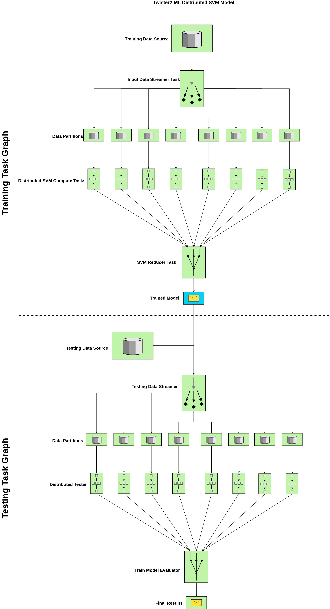

#Support Vector Machines

Support Vector Machines (SVM) is a supervised learning algorithm which is mainly used for the
purpose of classifying data. SVM algorithm is a light-weight classifier compared to Deep Neural
Networks. SVM is a highly used algorithm for classifying data. There are many varieties of SVMs 
which has been developed through out the years. The sequential minimal optimization ([SMO](https://pdfs.semanticscholar.org/59ee/e096b49d66f39891eb88a6c84cc89acba12d.pdf)) based approach 
is one of the most famouos modes in the early days of SVM. Then the research progreeses towards 
matrix decomposition methods like [PSVM](https://static.googleusercontent.com/media/research.google.com/en//pubs/archive/34638.pdf).
Both these methods are high computational intensive algorithms. Then the current research has 
diverted towards using gradient descent based approaches to solve the problem. These researchs show 
that this method is highly efficient and accuracy is as high as the traditional SMO-based and
matrix decomposition-based approaches. 

##Background

Currently Twister2 supports SGD-based SVM binary classifier with Linear Kernel. Our objective 
is to provide fully functional multi-class SVM classifier with multiple kernel support in a future
release.

Here S is a sample space where x<sub>i</sub> and y<sub>i</sub>,

S with n samples,x<sub>i</sub> refers to a d-dimensional feature vector and y<sub>i</sub> 
is  the  label  of  the i<sup>th</sup> sample.  


J<sup>t</sup> refers to the quadratic objective function which is minimized in the algorithm 
to obtain the convergence in the algorithm. 


This is the constraint of the objective function 


The weight vector updates takes as follows. Depending on the gradient of the objective function,


##SVM-SGD Sequential Algorithm 

Twister2:ML provides a basic Linear Kernel based SVM algorithm developed on top of stochastic
gradient descent based approach. The sequential algorithm is shown in Figure  


In the distributed algorithm, we model a data-parallel algorithm where each model work on a separate
data set (subset of full dataset). After each model is done with calculating the final weight 
vector we do a model synchronization. A preliminary research we did on this proves that this method
is highly efficient and accuracy of the algorithm doesn't dilute with the model synchronization 
frequency.

##Distributed SVM Batch Model - Task Example



####Components
 
* **Training Data Source** : This is an input from a text file (supported format csv) {label,features}
* **Testing Data Source** : This is an input from a text file (supported format csv) {label,features}
* **Distributed SVM Compute Tasks** : Set of Independent tasks running in parallel with the specified parallelism,
 (Note: In current implementation we recommend to use data parallelism = compute parallelism )
* **Input Data Streamer Task** : Loads the data with the configured parallelism and send to the SVM Compute Task
* **SVM Reducer Task** : Do a MPI-like model reduction to get the final model by averaging through the reduced value
(Note: This is one way of doing this. If you want to do an ensemble-like reduction, we need a voting mechanism.
Twister2 will support that in an upcoming release)
* **Trained Model** : This contains the final weight vector and important log information that you need to save to disk
In production or testing phase, you may only need to run the testing graph. Twister2 SVM can be customized
to support that functionality as well. 
* **Testing Data Streamer** : Loads the testing data in parallel with the defined parallelism. This way
we can do the testing process quite efficiently. You can increase this parallelism depending on your requirement
and it is independent of the data parallelism used in the training process. 
* **Distributed Tester** : Runs the SVM prediction algorithm on the testing data and provide the accuracy for the
tested batch. 
* **Train Model Evaluator** : The Distributed Tester provides the accuracy per testing data set and the 
evaluator does the MPI-like reduction over the response and provide the final accuracy. You can provide a custom
averaging function using Twister2 IFunctions to give a weighted average or any specific average function
depending on your expectation. Current algorithm supports a general MPI-like plain reduction and average it over
the number of processes (=no of data partitions) used in the testing process. 
* **Final Results** : Final results can be saved to disk and currently, Twister2 SVM shows time breakdown for 
testing, training, accuracy and data set specific info. 
 
 ##Code
 
 ### Data Loading
 
 Here is how we load data for training.
 
 ```java
DataObject<Object> data = null;
    DataObjectSource sourceTask = new DataObjectSource(Context.TWISTER2_DIRECT_EDGE,
        this.svmJobParameters.getTrainingDataDir());
    DataObjectSink sinkTask = new DataObjectSink();
    trainingBuilder.addSource(Constants.SimpleGraphConfig.DATA_OBJECT_SOURCE,
        sourceTask, dataStreamerParallelism);
    ComputeConnection firstGraphComputeConnection = trainingBuilder.addSink(
        Constants.SimpleGraphConfig.DATA_OBJECT_SINK, sinkTask, dataStreamerParallelism);
    firstGraphComputeConnection.direct(Constants.SimpleGraphConfig.DATA_OBJECT_SOURCE,
        Context.TWISTER2_DIRECT_EDGE, DataType.OBJECT);
    trainingBuilder.setMode(OperationMode.BATCH);

    DataFlowTaskGraph datapointsTaskGraph = trainingBuilder.build();
    ExecutionPlan firstGraphExecutionPlan = taskExecutor.plan(datapointsTaskGraph);
    taskExecutor.execute(datapointsTaskGraph, firstGraphExecutionPlan);
    data = taskExecutor.getOutput(
        datapointsTaskGraph, firstGraphExecutionPlan, Constants.SimpleGraphConfig.DATA_OBJECT_SINK);
```
 
 #### Code Explained
 
 ######Note: Task Names, Edge Names are defined using constants
 
 First you need to create a **DataSourceObject** which is an abstraction in Twister2 Data API.
 This way you can implicitly do the data loading in parallel and plug this in easily to the data
 streaming source task (this will be explained in a following section).
 
```java
DataObjectSource sourceTask = new DataObjectSource(Context.TWISTER2_DIRECT_EDGE,
        this.svmJobParameters.getTrainingDataDir());

```
**DataObjectSink** in Twister2 supports to get the parallelism you expect. 
This sink task is connected to the data loading Source Task which helps to partition the 
data equal to the parallelism you provide. Read the source code to get a clear idea. 

```java
DataObjectSink sinkTask = new DataObjectSink();
   trainingBuilder.addSource(Constants.SimpleGraphConfig.DATA_OBJECT_SOURCE,
       sourceTask, dataStreamerParallelism);

```

Now we need to create the data loading task graph. Source task can be added as follows. 

```java
trainingBuilder.addSource(Constants.SimpleGraphConfig.DATA_OBJECT_SOURCE,
       sourceTask, dataStreamerParallelism);

```

Next, the sink task of data loading must be added to the task graph, 

```java
ComputeConnection firstGraphComputeConnection = trainingBuilder.addSink(
       Constants.SimpleGraphConfig.DATA_OBJECT_SINK, sinkTask, dataStreamerParallelism);

```

The link between data loading source task and sink task is called a **direct** link. 
What we mean by a direct link is that the data is not undergoing any complex data flow, it is 
just direct flow of data from the given source to the sink using a direct communication. This 
is the simplest communication directive in Twister2. 

Then we need to set the type of the graph we built. Twister2 allows the user to set the computation model
as a batch or streaming. We recommend to use Batch mode for the current SVM example as the 
current computation model is specific to a batch case. 

```java
trainingBuilder.setMode(OperationMode.BATCH);
```

Now, the task graph has to be built and executed. 

```
 DataFlowTaskGraph datapointsTaskGraph = trainingBuilder.build();
   ExecutionPlan firstGraphExecutionPlan = taskExecutor.plan(datapointsTaskGraph);
   taskExecutor.execute(datapointsTaskGraph, firstGraphExecutionPlan);

```

Finally, we can get the partitioned data set as a data object which we call as a **DataObject**
which can be defined as a generic type depending on the programming logic or your preference.

```java
data = taskExecutor.getOutput(
       datapointsTaskGraph, firstGraphExecutionPlan, Constants.SimpleGraphConfig.DATA_OBJECT_SINK);

```

This data object has partitions equal to the amount of parallelism provided in the task definition. 


###### Note: Testing data is also loaded in a similar way. 


### Training

Next step is to train the SVM algorithm using the loaded data. For that we create another
task graph called training task graph which can be considered as the first major component in 
the distributed SVM algorithm. 

```java
DataObject<double[]> trainedWeight = null;

    dataStreamer = new InputDataStreamer(this.operationMode,
        svmJobParameters.isDummy(), this.binaryBatchModel);
    svmCompute = new SVMCompute(this.binaryBatchModel, this.operationMode);
    svmReduce = new SVMReduce(this.operationMode);

    trainingBuilder.addSource(Constants.SimpleGraphConfig.DATASTREAMER_SOURCE, dataStreamer,
        dataStreamerParallelism);
    ComputeConnection svmComputeConnection = trainingBuilder
        .addCompute(Constants.SimpleGraphConfig.SVM_COMPUTE, svmCompute, svmComputeParallelism);
    ComputeConnection svmReduceConnection = trainingBuilder
        .addSink(Constants.SimpleGraphConfig.SVM_REDUCE, svmReduce, reduceParallelism);

    svmComputeConnection
        .direct(Constants.SimpleGraphConfig.DATASTREAMER_SOURCE,
            Constants.SimpleGraphConfig.DATA_EDGE, DataType.OBJECT);
    svmReduceConnection
        .reduce(Constants.SimpleGraphConfig.SVM_COMPUTE, Constants.SimpleGraphConfig.REDUCE_EDGE,
            new ReduceAggregator(), DataType.OBJECT);

    trainingBuilder.setMode(operationMode);
    DataFlowTaskGraph graph = trainingBuilder.build();
    ExecutionPlan plan = taskExecutor.plan(graph);

    taskExecutor.addInput(
        graph, plan, Constants.SimpleGraphConfig.DATASTREAMER_SOURCE,
        Constants.SimpleGraphConfig.INPUT_DATA, trainingData);

    taskExecutor.execute(graph, plan);

    LOG.info("Task Graph Executed !!! ");

    trainedWeight = retrieveWeightVectorFromTaskGraph(graph, plan);


```

#### Code Explained

First, we initialize the components in the graph. There are three basic components in the 
training graph. They are;

1. [Input Data Streamer](https://github.com/DSC-SPIDAL/twister2/blob/master/twister2/examples/src/java/edu/iu/dsc/tws/examples/ml/svm/streamer/InputDataStreamer.java) : loads the data in parallel and do initialization of models and other 
used defined pre-processings. 
2. [SVM Compute Task](https://github.com/DSC-SPIDAL/twister2/blob/master/twister2/examples/src/java/edu/iu/dsc/tws/examples/ml/svm/compute/SVMCompute.java) : Runs the SVM algorithm on a partition of data.
3. [SVM Reduce Task](https://github.com/DSC-SPIDAL/twister2/blob/master/twister2/examples/src/java/edu/iu/dsc/tws/examples/ml/svm/aggregate/SVMReduce.java)  : Generates the averaged model over all models trained in parallel

Here is how we initialize each of these tasks.
###### Note : Dummy data based training option is there just to test the application.


```java
dataStreamer = new InputDataStreamer(this.operationMode,
        svmJobParameters.isDummy(), this.binaryBatchModel);
    svmCompute = new SVMCompute(this.binaryBatchModel, this.operationMode);
    svmReduce = new SVMReduce(this.operationMode);
```

In a similar way we used to create the task graph in data loading section, we use a similar approach 
to design the training task graph.

A source task is always added by **addingSource** method

Make sure to use task graph edges and task node names using constants. Reduction parallelism is 
always unity(=1) and the compute parallelism is recommended to be used as same as the data 
parallelism. The reasoning is that each compute node will work on the partitioned data. 
The link between input data stream and the compute node is direct and that's why we keep 
the parallelisms as stated. In the Reduction phase you can use a data aggregator of your own 
choice. In the [current aggregator](https://github.com/DSC-SPIDAL/twister2/blob/master/twister2/examples/src/java/edu/iu/dsc/tws/examples/ml/svm/aggregate/ReduceAggregator.java) logic, we just do a basic MPI-like reduction.


```java
trainingBuilder.addSource(Constants.SimpleGraphConfig.DATASTREAMER_SOURCE, dataStreamer,
        dataStreamerParallelism);
    ComputeConnection svmComputeConnection = trainingBuilder
        .addCompute(Constants.SimpleGraphConfig.SVM_COMPUTE, svmCompute, svmComputeParallelism);
    ComputeConnection svmReduceConnection = trainingBuilder
        .addSink(Constants.SimpleGraphConfig.SVM_REDUCE, svmReduce, reduceParallelism);

    svmComputeConnection
        .direct(Constants.SimpleGraphConfig.DATASTREAMER_SOURCE,
            Constants.SimpleGraphConfig.DATA_EDGE, DataType.OBJECT);
    svmReduceConnection
        .reduce(Constants.SimpleGraphConfig.SVM_COMPUTE, Constants.SimpleGraphConfig.REDUCE_EDGE,
            new ReduceAggregator(), DataType.OBJECT);
```

The graph can be initialized as follows,

```java
trainingBuilder.setMode(operationMode);
    DataFlowTaskGraph graph = trainingBuilder.build();
    ExecutionPlan plan = taskExecutor.plan(graph);

```

Next, the important thing is to add the input to the task graph. The input is the data object
that we loaded in the training data loading stage. It can be done like this,

```java
taskExecutor.addInput(
        graph, plan, Constants.SimpleGraphConfig.DATASTREAMER_SOURCE,
        Constants.SimpleGraphConfig.INPUT_DATA, trainingData);
```

Here, you need to specify to which task you're adding the data. Here our task is the streaming data
source task. Then we just need to provide the reference of the loaded data object to the **addInput** function.
Then you can execute the task graph. 

```java
taskExecutor.execute(graph, plan);
```

You can use the **getOutput** method in task executor to obtain the final results of the graph. 
This final result will be the trained model. Here the trained model only refers to the final weight vector. 


### Testing

Testing is also done in parallel and a similar task graph like training task graph is created, 
but the tasks inside this graph a light weight. It is just straight forward model evaluation in 
O(Nd) (d is number of features, N number of samples) time. The major difference in testing task graph 
is we input both the trained model (weight vector) and the testing data set to the taskgraph as inputs. 

Finally a reduction operation is done to get the final accuracy of the testing model.

You can find the code to our SVM Implementation 
[here](https://github.com/DSC-SPIDAL/twister2/blob/master/twister2/examples/src/java/edu/iu/dsc/tws/examples/ml/svm/job/SvmSgdAdvancedRunner.java).


 ## Run Batch SVM
 
 Sample Execution
 
 ### Data Format :
 
 ```csv
 label,feature_1,feature_2,...,feature_d

```
Binary classification is only supported in the current release. Make sure labels are +1 and -1 
for the two classes. The data should be in CSV format with dense matrix representation. 
If you're using LibSVM format data, first use a [LibSVM -> CSV converter](https://github.com/zygmuntz/phraug/blob/master/libsvm2csv.py)
to convert data to the dense format. 

 ###Run SVM
 
 ```bash
 ./bin/twister2 submit standalone jar examples/libexamples-java.jar edu.iu.dsc.tws.examples.ml.svm.SVMRunner -ram_mb 4096 -disk_gb 2 -instances <no of instances> -alpha <learning rate>-C <hyper-parameter-in-constraint-function> -exp_name <experiment-name> -features <features> -samples <total-samples> -iterations <iterations> -training_data_dir <training-csv-file> -testing_data_dir <testing-csv-file> -parallelism <overall-parallelism> -workers <no of workers> -cpus <no of cpus> -threads <threds to be used in the scheduler>

```
 
 #### Sample Run
 
 ```bash
./bin/twister2 submit standalone jar examples/libexamples-java.jar edu.iu.dsc.tws.examples.ml.svm.SVMRunner -ram_mb 4096 -disk_gb 2 -instances 1 -alpha 0.1 -C 1.0 -exp_name test-svm -features 22 -samples 35000 -iterations 10 -training_data_dir <path-to-training-csv> -testing_data_dir <path-to-testing-csv> -parallelism 8 -workers 1 -cpus 1 -threads 4
```

#### Sample Output


```bash
Training Dataset [/home/vibhatha/data/svm/w8a/training.csv] 
Testing  Dataset [/home/vibhatha/data/svm/w8a/testing.csv] 
Data Loading Time (Training + Testing) 				= 1.943881115  s 
Training Time 							= 7.978291269  s 
Testing Time  							= 0.828260105  s 
Total Time (Data Loading Time + Training Time + Testing Time) 	= 10.750432489  s 
Accuracy of the Trained Model 					= 88.904494382 %

```


##Distributed SVM Batch Model - Tset Example

TSet is an abstraction for the Task API. The reason behind using TSet is to provide 
much easier coding environment for API users. For developer level using Task Example
will be much easier when you want to write plug-ins for existing programmes. In TSet
level most of the Task level APIs are abstracted to provide a readable interface. 

The design model used in here is as same as the task example. Let's go through the code.


```java
CachedTSet<double[][]> trainingData = loadTrainingData();
    CachedTSet<double[][]> testingData = loadTestingData();
    MapTSet<double[], double[][]> svmTrainTset = trainingData
        .map(new SvmTrainMap(this.binaryBatchModel, this.svmJobParameters));
    //svmTset.addInput("trainingData", testingData);
    ReduceTLink<double[]> reduceTLink = svmTrainTset.reduce((t1, t2) -> {
      double[] w1 = new double[t1.length];
      try {
        w1 = Matrix.add(t1, t2);
      } catch (MatrixMultiplicationException e) {
        e.printStackTrace();
      }
      return w1;
    });

    CachedTSet<double[]> finalW = reduceTLink
        .map(new ModelAverager(this.svmJobParameters.getParallelism())).cache();
    double[] wFinal = finalW.getData().get(0);
    this.binaryBatchModel.setW(wFinal);
    LOG.info(String.format("Data : %s",
        Arrays.toString(wFinal)));

    MapTSet<Double, double[][]> svmTestTset = testingData
        .map(new SvmTestMap(this.binaryBatchModel, this.svmJobParameters));
    ReduceTLink<Double> reduceTestLink = svmTestTset.reduce((t1, t2) -> {
      double t = t1 + t2;
      return t;
    });
    CachedTSet<Double> finalAcc = reduceTestLink
        .map(new AccuracyAverager(this.svmJobParameters.getParallelism())).cache();
    double acc = finalAcc.getData().get(0);
    LOG.info(String.format("Training Accuracy : %f ", acc));
```

### Code Explained

First, we need to load the training data, 

```java
CachedTSet<double[][]> data = this.twisterBatchContext.createSource(
        new DataLoadingTask(this.binaryBatchModel, this.svmJobParameters, "train"),
        this.dataStreamerParallelism).setName("trainingDataSource").cache();
```

Here we need to create a data loading task. 

When using TSets, you need to load the data using the same Data API interfaces. 
But here, we provided less abstraction towards data loading, so that user can 
define their logics within **DataLoadingTask** (More details are below). 

In the DataLoading task, the data object must be defined with reference to the number
of partitions considering the total data size. 

```java
 public void prepare() {
    this.config = context.getConfig();
    this.parallelism = context.getParallelism();
    // dimension is +1 features as the input data comes along with the label
    this.dimension = this.binaryBatchModel.getFeatures() + 1;
    if ("train".equalsIgnoreCase(this.dataType)) {
      this.dataSize = this.binaryBatchModel.getSamples();
      this.localPoints = new double[this.dataSize / (this.parallelism + 1)][this.dimension];
      this.source = new DataSource(config, new LocalFixedInputPartitioner(new
          Path(this.svmJobParameters.getTrainingDataDir()), this.parallelism, config,
          this.dataSize), this.parallelism);
    }
    if ("test".equalsIgnoreCase(this.dataType)) {
      this.dataSize = this.svmJobParameters.getTestingSamples();
      this.localPoints = new double[this.dataSize / (this.parallelism + 1)][this.dimension];
      this.source = new DataSource(config, new LocalFixedInputPartitioner(new
          Path(this.svmJobParameters.getTestingDataDir()), this.parallelism, config,
          this.dataSize), this.parallelism);
    }
  }
```

Here the data loader has to load the data considering training and testing data sizes.
So the source path and data sizes are different. The data size means the number of 
lines in your file (it must be in csv format as mentioned in the task example section).
Currently that field is not implicitly handled in the current release (0.2.1).

**DataLoadingTask** extends the **BaseSource**, so the expected data type can be defined. 
The overriden **next()** method uses the Twister2 Data API to load the data. 

```java
  public double[][] next() {
    LOG.fine("Context Prepare Task Index:" + context.getIndex());
    InputSplit inputSplit = this.source.getNextSplit(context.getIndex());
    int totalCount = 0;
    while (inputSplit != null) {
      try {
        int count = 0;
        while (!inputSplit.reachedEnd()) {
          String value = (String) inputSplit.nextRecord(null);
          if (value == null) {
            break;
          }
          String[] splts = value.split(",");
          if (debug) {
            LOG.info(String.format("Count %d , splits %d, dimensions %d", count, splts.length,
                this.dimension));
          }

          if (count >= this.localPoints.length) {
            break; // TODO : unbalance division temp fix
          }
          for (int i = 0; i < this.dimension; i++) {
            this.localPoints[count][i] = Double.valueOf(splts[i]);
          }
          if (value != null) {
            count += 1;
          }
        }
        inputSplit = this.source.getNextSplit(context.getIndex());
      } catch (IOException e) {
        LOG.log(Level.SEVERE, "Failed to read the input", e);
      }
    }
    return this.localPoints;
  }
```

###### Note : Loading data format depends on the data processing logics that you have aleady defined in your program. Handl the data loading with care. You can use a filter function to process them in the expected way.

The loaded data has to be referenced via a **Cacheable Tset => CashedTSet** object. 

```java
    CachedTSet<double[][]> trainingData = loadTrainingData();
    CachedTSet<double[][]> testingData = loadTestingData();
```

Now, the training has to be done on the loaded data. 

```java
  MapTSet<double[], double[][]> svmTrainTset = trainingData
        .map(new SvmTrainMap(this.binaryBatchModel, this.svmJobParameters));
```
The Training logic must be programmed inside the a Map class which is extended from the
**BaseMapFunction<T,O)>**. Here the input data format defines **T** and the expected 
output data format defines **O**.  

Then the reduce function has to be called to reduce the trained models to get a
globally synchronized model. Here, the lambda functions has been used to do it quite
effectively without creating a new class. Here a **ReduceTLink** a TLink specialized
to perform reduction operation is used. This is another abstraction we use in TSet based
application development. 

```java
ReduceTLink<double[]> reduceTLink = svmTrainTset.reduce((t1, t2) -> {
      double[] w1 = new double[t1.length];
      try {
        w1 = Matrix.add(t1, t2);
      } catch (MatrixMultiplicationException e) {
        e.printStackTrace();
      }
      return w1;
    });
```


Next step is to obtain the averaged model over the executed reduction. 

```java
CachedTSet<double[]> finalW = reduceTLink
        .map(new ModelAverager(this.svmJobParameters.getParallelism())).cache();
    double[] wFinal = finalW.getData().get(0);
```
TSetLinks provide a Map interface to write customizable mapping functions depending user requirment
to get processed output. Here a simple average is performed over the globally synchronized data
using the **ModelAverager** class. It is nothing but averaging to get the mean of the globally
synchronied model with respect to the parallelism. 

**getData** method returns the partitions and as this is a reduce example there 
will be a single partition. 

 
 In the testing stage, we used the same model as used in the task example. The testing is also
 done in parallel. 
 
 ```java
IterableMapTSet<Double, double[][]> svmTestTset = testingData
        .map(new SvmTestMap(this.binaryBatchModel, this.svmJobParameters));
    ReduceTLink<Double> reduceTestLink = svmTestTset.reduce((t1, t2) -> {
      double t = t1 + t2;
      return t;
    });
```

As same as a training Mapper task, a testing mapper task is defined to run the
SVM prediction within the **SVMTestMap** interface. We abstract the computation logic
inside this Map class. And finally, a reduction is performed on the accuracy calculated
per test data set. 

```java
 CachedTSet<Double> finalAcc = reduceTestLink
        .map(new AccuracyAverager(this.svmJobParameters.getParallelism())).cache();
    double acc = finalAcc.getData().get(0);
    LOG.info(String.format("Training Accuracy : %f ", acc));
``` 

Final testing accuracy can be obtained by averaging through the globally synchronized value. 
For that a simple map function can be plugged into the TSetLink. 

###### Note we use a separate TSet Link per a specific task. 

### Running TSet Based SVM

```bash
./bin/twister2 submit standalone jar examples/libexamples-java.jar edu.iu.dsc.tws.examples.ml.svm.SVMRunner -ram_mb <ram-size-MB> -disk_gb <disk-size-in-GB> -instances <no-of-instances> -alpha <learning rate> -C <training-constraint> -exp_name <experiment-name> -features <dimension of a data point> -samples <no-of-training-samples> -iterations <iterations> -training_data_dir <training-data-file> -testing_data_dir <testing-data-file>-parallelism <overall-parallelism> -workers <no-of-workers> -cpus <no-of-cpus> -threads <no-threads-for-scheduler> -svm_run_type tset -testing_samples <testing-samples>

```

#### Sample Run

```bash
./bin/twister2 submit standalone jar examples/libexamples-java.jar edu.iu.dsc.tws.examples.ml.svm.SVMRunner -ram_mb 4096 -disk_gb 2 -instances 1 -alpha 0.1 -C 1.0 -exp_name test-svm -features 300 -samples 49749 -iterations 10 -training_data_dir <training-data-csv-file> -testing_data_dir <testing-data-csv-file> -parallelism 8 -workers 1 -cpus 1 -threads 4 -svm_run_type tset -testing_samples 14951

```

#### Sample Output

```bash
[2019-03-28 16:40:31 -0400] [INFO] [worker-0] [main] edu.iu.dsc.tws.examples.ml.svm.job.SvmSgdTsetRunner: Training Accuracy : 88.049368

```

###### Note make sure you have formatted the CSV files as instructed in the SVM Task Example. 