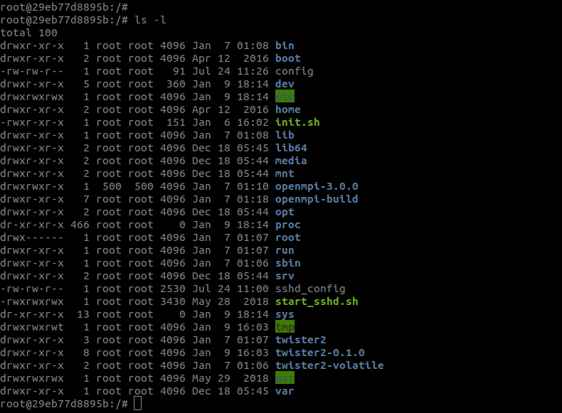
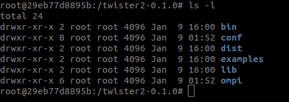

# Developing Big Data Solutions in Twister2

In this section, you will learn how to run  the chosen examples and
will get an idea on how to write your own code to run on twister2.

We will first give the instructions
for using the Docker image prepared for standalone twister2 environment.
The second option is using a twister2-ready cluster on one of our systems, called Echo. We will explain how to use Echo systems to run your jobs.
We will start with a simple Hello World example and then continue with more complex example.

* [Docker image](developing.md#docker-image)
* [Using Echo cluster](developing.md#echo-cluster)


## Docker Image 

We have created a Docker container for you to easily run jobs on twister2.
This container has all the necessary software installed in order to run
twister2 jobs using standalone resource scheduler.

Execute the two commands to pull the docker image and launch a container instance.

```bash
sudo docker pull twister2tutorial/twister2:standalone

sudo docker run -it twister2tutorial/twister2:standalone bash
```



Docker image has Twister2 installed and you can run examples.

You should go into twister2-0.2.1 directory first.

```bash
cd twister2-0.2.1/

ls
```



Then, to run an example you can use the ```twister2 submit``` command with ```standlone``` as the cluster.

For example;

To run hello world example;

```bash
  ./bin/twister2 submit standalone jar examples/libexamples-java.jar edu.iu.dsc.tws.examples.basic.HelloWorld
```
To run batch word count example
```bash
  ./bin/twister2 submit standalone jar examples/libexamples-java.jar edu.iu.dsc.tws.examples.batch.wordcount.task.WordCountJob
```
To run streaming word count example
```bash
./bin/twister2 submit standalone jar examples/libexamples-java.jar edu.iu.dsc.tws.examples.streaming.wordcount.task.WordCountJob
```
To run K-means example
```bash
./bin/twister2 submit standalone jar examples/libexamples-java.jar edu.iu.dsc.tws.examples.batch.kmeans.KMeansJobMain -workers 4 -iter 2 -dim 2 -clusters 4 -fname /tmp/output.txt -pointsfile /tmp/kinput.txt -centersfile /tmp/kcentroid.txt -points 100 -filesys local -pseedvalue 100 -cseedvalue 500 -input generate -parallelism 4
```
To run joins example
```bash
./bin/twister2 submit standalone jar examples/libexamples-java.jar edu.iu.dsc.tws.examples.comms.ExampleMain -workers 8 -op "joinstudent" -stages 8,1 2>&1 | tee out.txt
```


Here are some useful docker commands

```bash
# Remove useless docker images
sudo docker image rm <useless-docker-image>
# Remove exited containers
sudo docker rm $(sudo docker ps -a -f status=exited -q)
# Clean up all dangling cache
sudo docker system prune
```

Find the docker container ID

```bash
sudo docker ps
```

and log into the docker

```bash
sudo docker exec -it <container_id> bash
```

## Echo Cluster

This option will utilize the already running Twister2 systems including the resource schedulers; Kubernetes and Mesos.
Echo cluster consists of four nodes. Each node in this cluster consists of 24 CPU cores, 384 GB of memory and 2.3 TB of disk.

Please follow the instructions below to run jobs on Echo cluster.

Use SSH to login to following Echo machine by using the username and password given to you.

```bash
ssh username@149.165.150.84
```

Twister2 is installed under twister2 directory.

Go to the directory:

```bash
cd twister2-0.2.1
```

Then, to run an example you can use the ```twister2 submit``` command.

You can check the status of the submitted job through the dashboard provided by the resource scheduler.  For our Echo Cluster the address is;

```text
Kubernetes ---> http://149.165.150.81:8080/#/jobs
```

If you want to see the logs on Kubernetes, you need to get the list of the pods first;

```bash
kubectl get pods
```
Then check the logs with the following command

```bash
kubectl logs -f <pod-name>
```

You can also check the logs under the NFS directory. In order to do that you should go to the following directory. You will see the logs for job master and each worker there. 

```bash
cd /nfs/shared/"archived job directory"/logs
archived job directory = "archived-default-twister2-storage-" + "job name" + "-pvc-" + "random code"  
```


## Examples

We have five examples for you.

* [Hello world example](developing.md#hello-world-example)
* [Batch wordcount example](developing.md#batch-wordcount-example)
* [Streaming wordcount example](developing.md#streaming-wordcount-example)
* [Machine learning example K-Means](developing.md#machine-learning-example-kmeans)
* [Joins example](developing.md#joins-example)


## Hello World Example

In this part we will explain how the HelloWorld example runs.
You will get an idea how to write a simple twister2 job,
submit it and then check the output.

In order to run these examples, you should have a running Kubernetes or a Mesos cluster, configured as stated on Twister2 website.
You can submit jobs to chosen resource scheduler by using Twister2 executable;

```bash
./bin/twister2
```

When submitting jobs to Kubernetes clusters, you need to specify the cluster name as "kubernetes".  Likewise this parameter should be “mesos” if submitting to a Mesos cluster.

You can submit HelloWorld job in examples package with 8 workers as;

```bash
./bin/twister2 submit kubernetes jar examples/libexamples-java.jar edu.iu.dsc.tws.examples.basic.HelloWorld 8
```

If you are using our testbed cluster “Echo”,

1. Login to your account in Echo
2. Change you directory to  ```twister2-0.2.1```
3. Run the command above.

You can check the status of the submitted job on Kubernetes through the dashboard provided by the resource scheduler.  For our Echo Cluster the address is;

```text
Kubernetes ---> http://149.165.150.81:8080/#/jobs
```

If you want to see the logs on Kubernetes, you need to get the list of the pods first;

```bash
kubectl get pods
```
Then check the logs with the following command

```bash
kubectl logs -f <pod-name>
```

You can also check the logs under the NFS directory. In order to do that you should go to the following directory. You will see the logs for job master and each worker there. 

```bash
cd /nfs/shared/"archived job directory"/logs
archived job directory = "archived-default-twister2-storage-" + "job name" + "-pvc-" + "random code"  
```

HelloWorld job runs for 1 minute. After 1 minute, the job becomes COMPLETED if everything is fine.

Lets check the code; In the main method;
* First set the number of workers by using the arguments passed by the command line. If there is no arguments then the default value is 4
* Then we load the configurations from command line and config files(yaml files) and put it in a JobConfig object.

```java
 Config config = ResourceAllocator.loadConfig(new HashMap<>());
    JobConfig jobConfig = new JobConfig();
    jobConfig.put("hello-key", "Twister2-Hello");
```

We then create the Twister2 job object by the following code.

```java
  Twister2Job twister2Job = Twister2Job.newBuilder()
   		.setJobName("hello-world-job")
   		.setWorkerClass(HelloWorld.class)
   		.addComputeResource(2, 1024, numberOfWorkers)
   		.setConfig(jobConfig)
   		.build();
```

Last thing we do is submitting the job

```java
   Twister2Submitter.submitJob(twister2Job, config);
```   

After the submission execute method of this HelloWorld class will be called on each worker. So that means the code in the execute method will be run on every worker

```java
   public void execute(Config config, int workerID,
      IWorkerController workerController,
      IPersistentVolume persistentVolume,
      IVolatileVolume volatileVolume);
```         

In our case the rest of the code writes hello message from each worker including their IDs, total number of workers and the message and then sleeps for one minute

```java
  // lets retrieve the configuration set in the job config
  String helloKeyValue = config.getStringValue("hello-key");
  
  // lets do a log to indicate we are running
  LOG.log(Level.INFO, String.format("Hello World from Worker %d; there are %d total workers "
          + "and I got a message: %s", workerID,
      workerController.getNumberOfWorkers(), helloKeyValue));
  
  List<JobMasterAPI.WorkerInfo> workerList = null;
  try {
    workerList = workerController.getAllWorkers();
  } catch (TimeoutException timeoutException) {
    LOG.log(Level.SEVERE, timeoutException.getMessage(), timeoutException);
    return;
  }
  String workersStr = WorkerInfoUtils.workerListAsString(workerList);
  LOG.info("All workers have joined the job. Worker list: \n" + workersStr);
  
  try {
    LOG.info("I am sleeping for 1 minute and then exiting.");
    Thread.sleep(60 * 1000);
    LOG.info("I am done sleeping. Exiting.");
  } catch (InterruptedException e) {
    LOG.severe("Thread sleep interrupted.");
  }
```

You can access to the presentation using the link below

[Hello Word example](https://docs.google.com/presentation/d/1ZMeO5aofZZNKwoR66N6b4hzSJqlGlbWgZLOq8Ie6vl0/edit#slide=id.p)


## Batch WordCount Example

In this section we will run a batch word count example from Twister2.
After checking this example, you will have an idea on how to write a batch processing example on Twister2.

Job terminates after processing finite amount of input data
Fixed number of words are generated and the global counts of words are calculated

It uses communication layer and resource scheduling layer

The example code can be found in
```bash
twister2/examples/src/java/edu/iu/dsc/tws/examples/batch/wordcount/task/
```

In order to run the example go to the following directory
```bash
cd twister2-0.2.1
```


And run the command below  using kubernetes resource scheduler

```bash
./bin/twister2 submit kubernetes jar examples/libexamples-java.jar edu.iu.dsc.tws.examples.batch.wordcount.task.WordCountJob
```


It will run 4 executors with 8 tasks
* Each executor will have two tasks
* At the first phase tasks 0-3 running on each executor will generate words
* After the words are generated, task 5-8 will consume those words and count.

You can check the status of the submitted job on Kubernetes through the dashboard provided by the resource scheduler.  For our Echo Cluster the address is;

```text
Kubernetes ---> http://149.165.150.81:8080/#/jobs
```

If you want to see the logs on Kubernetes, you need to get the list of the pods first;

```bash
kubectl get pods
```
Then check the logs with the following command

```bash
kubectl logs -f <pod-name>
```

You can also check the logs under the NFS directory. In order to do that you should go to the following directory. You will see the logs for job master and each worker there. 

```bash
cd /nfs/shared/"archived job directory"/logs
archived job directory = "archived-default-twister2-storage-" + "job name" + "-pvc-" + "random code"  
```


You can access to the presentation using the link below

[Batch Processing Example](https://docs.google.com/presentation/d/1hpBcy_-m5AuVJJxPdhX_5hnIVB4vUkiB6My0STp-dLA/edit#slide=id.p)

## Streaming WordCount Example

In this section we will introduce a streaming word count example from Twister2.
After checking this example, you will have an idea on how to write a streaming example on Twister2.

This example is a streaming word count job.
It is a continuously running job,  processing an unbounded stream of data

Fixed number of words are generated and the global counts of words are calculated

It uses communication layer and resource scheduling layer

The example code can be found in

```bash
twister2/examples/src/java/edu/iu/dsc/tws/examples/streaming.wordcount/task/
```

In order to run the example go to the following directory

```bash
cd twister2-0.2.1
```


And run the command below  using kubernetes resource scheduler

```bash
./bin/twister2 submit kubernetes jar examples/libexamples-java.jar edu.iu.dsc.tws.examples.streaming.wordcount.task.WordCountJob
```


It will run 4 executors with 8 tasks
* Each executor will have two tasks
* Uses key based gather communication between source and sink tasks
* The tasks in the first two executors will generate words
* The tasks in the last two executors will keep word count.

After running the example, you will see an output like the following;

```bash
[2019-01-09 09:50:52 +0000] [INFO] edu.iu.dsc.tws.examples.streaming.wordcount.task.WordCountJob: 2 Word wA count 1
[2019-01-09 09:50:52 +0000] [INFO] edu.iu.dsc.tws.examples.streaming.wordcount.task.WordCountJob: 0 Word 4 count 1
[2019-01-09 09:50:52 +0000] [INFO] edu.iu.dsc.tws.examples.streaming.wordcount.task.WordCountJob: 2 Word lJx count 1
[2019-01-09 09:50:52 +0000] [INFO] edu.iu.dsc.tws.examples.streaming.wordcount.task.WordCountJob: 0 Word gxsn count 1
```

At this point you should manually stop the process (CTRL+C)


You can check the status of the submitted job on Kubernetes through the dashboard provided by the resource scheduler.  For our Echo Cluster the address is;

```text
Kubernetes ---> http://149.165.150.81:8080/#/jobs
```

If you want to see the logs on Kubernetes, you need to get the list of the pods first;

```bash
kubectl get pods
```
Then check the logs with the following command

```bash
kubectl logs -f <pod-name>
```

You can also check the logs under the NFS directory. In order to do that you should go to the following directory. You will see the logs for job master and each worker there. 

```bash
cd /nfs/shared/"archived job directory"/logs
archived job directory = "archived-default-twister2-storage-" + "job name" + "-pvc-" + "random code"  
```


You can access to the presentation using the link below

[Streaming Processing Example](https://docs.google.com/presentation/d/17uDBBlQxqzLx3m_inOM9svYvANCEwF2nN1KUYDoqInM/edit#slide=id.p)


## Machine Learning Example KMeans

K-Means clustering algorithm is one of the simplest and popular machine learning algorithms. We have implemented it on Twister2.

### K-Means Clustering

The need to process large amounts of continuously arriving information has led to the exploration and application of big data analytics techniques. Likewise, the painstaking process of clustering numerous datasets containing large numbers of records with high dimensions calls for innovative methods. Traditional sequential clustering algorithms are unable to handle it. They are not scalable in relation to larger sizes of data sets, and they are most often computationally expensive in memory space and time complexities. Yet, the parallelization of data clustering algorithms is paramount when dealing with big data. K-Means clustering is an iterative algorithm hence, it requires a large number of iterative steps to find an optimal solution, and this procedure increases the processing time of clustering. Twister2 provides a dataflow task graph based approach to distribute the tasks in a parallel manner and aggregate the results which reduces the processing time of K-Means Clustering process.

### To run K-Means

This command generate and write the datapoints and centroids in the local filesystem and run the K-Means algorithm.

#### Kubernetes

```bash
./bin/twister2 submit kubernetes jar examples/libexamples-java.jar edu.iu.dsc.tws.examples.batch.kmeans.KMeansJobMain -workers 4 -iter 2 -dim 2 -clusters 4 -fname /tmp/output.txt -pointsfile /tmp/kinput.txt -centersfile /tmp/kcentroid.txt -points 100 -filesys local -pseedvalue 100 -cseedvalue 500 -input generate -parallelism 4

```

This command generate and write the datapoints and centroids in the HDFS and run the K-Means algorithm.


#### Kubernetes

```bash
./bin/twister2 submit kubernetes jar examples/libexamples-java.jar edu.iu.dsc.tws.examples.batch.kmeans.KMeansJobMain -workers 4 -iter 2 -dim 2 -clusters 4 -fname /tmp/output.txt -pointsfile /tmp/kinput.txt -centersfile /tmp/kcentroid.txt -points 100 -filesys hdfs -pseedvalue 100 -cseedvalue 200 -input generate -parallelism 4
```


You can check the status of the submitted job on Kubernetes through the dashboard provided by the resource scheduler.  For our Echo Cluster the address is;

```text
Kubernetes ---> http://149.165.150.81:8080/#/jobs
```

If you want to see the logs on Kubernetes, you need to get the list of the pods first;

```bash
kubectl get pods
```
Then check the logs with the following command

```bash
kubectl logs -f <pod-name>
```

You can also check the logs under the NFS directory. In order to do that you should go to the following directory. You will see the logs for job master and each worker there. 

```bash
cd /nfs/shared/"archived job directory"/logs
archived job directory = "archived-default-twister2-storage-" + "job name" + "-pvc-" + "random code"  
```

### Implementation Details

#### KMeansConstants

```java
public static final String ARGS_WORKERS = "workers";

public static final String ARGS_ITR = "iter";

public static final String ARGS_FNAME = "fname";

public static final String ARGS_POINTS = "pointsfile";

public static final String ARGS_CENTERS = "centersfile";

public static final String ARGS_DIMENSIONS = "dim";

public static final String ARGS_CLUSTERS = "clusters";

public static final String ARGS_NUMBER_OF_POINTS = "points";

public static final String ARGS_FILESYSTEM = "filesys"; // "local" or "hdfs"

public static final String ARGS_POINTS_SEED_VALUE = "pseedvalue"; //range for random data points generation

public static final String ARGS_CENTERS_SEED_VALUE = "cseedvalue"; //range for centroids generation

public static final String ARGS_DATA_INPUT = "input"; //"generate" or "read"

public static final String ARGS_PARALLELISM_VALUE = "parallelism";
```

#### KMeansMainJob

The entry point for the K-Means clustering algorithm is implemented in KMeansMainJob

```text
edu.iu.dsc.tws.examples.batch.kmeans.KMeansMainJob
```

It retrieves and parses the command line parameters submitted by the user for running the K-Means Clustering algorithm. It sets the submitted variables in the Configuration object and put the object into the JobConfig and submit it to KMeansJob class.

#### KMeansJob

It is the main class for the K-Means clustering which has the following classes namely KMeansSource, KMeansAllReduceTask, and CentroidAggregator. First, the execute method in KMeansJob invokes the KMeansDataGenerator to generate the datapoints file and centroid file, if the user has specified the option ARGS\_DATA\_INPUT as "generate". Next, it will invoke the KMeansDataGenerator class and store the generated datapoints and centroids in each worker (locally) or in the distributed file system which is based on the option ARGS\_FILESYSTEM as "local" or "hdfs". Then, it will invoke the KMeansFileReader to read the input datafile/centroid file either from locally or HDFS.

Next, the datapoints are stored in DataSet \(0th object\) and centroids are stored in DataSet \(1st object\) and call the executor as given below:

```java
taskExecutor.addInput(graph, plan, "source", "points", datapoints);

taskExecutor.addInput(graph, plan, "source", "centroids", centroids);

taskExecutor.execute(graph, plan);
```

This process repeats for ‘N’ number of iterations as specified in the KMeansConstants . For every iteration, the new centroid value is calculated and the calculated value is distributed across all the task instances.

```java
DataSet<Object> dataSet = taskExecutor.getOutput(graph, plan, "sink");

Set<Object> values = dataSet.getData();

for (Object value : values) {
  KMeansCenters kMeansCenters = (KMeansCenters) value;
 centroid = kMeansCenters.getCenters();
}
```

At the end of every iteration, the centroid value is updated and the iteration continues with the new centroid value.

```java
datapoints.addPartition(0, dataPoint);

centroids.addPartition(1, centroid);
```

#### KMeansSourceTask

The KMeansSourceTask retrieve the input data file and centroid file name, it first calculate the start index and end index which is based on the total data points and the parallelism value as given below:

```java
int startIndex = context.taskIndex() * datapoints.length / context.getParallelism();

int endIndex = startIndex + datapoints.length / context.getParallelism();
```

Then, it calls the KMeansCalculator class to calculate and get the centroid value for the task instance.

```java
kMeansCalculator = new KMeansCalculator(datapoints, centroid,
        context.taskIndex(), 2, startIndex, endIndex);

KMeansCenters kMeansCenters = kMeansCalculator.calculate();
```

Finally, each task instance write their calculated centroids value as given below:

```java
context.writeEnd("all-reduce", kMeansCenters);
```

#### KMeansAllReduce Task

The KMeansAllReduceTask retrieve the calculated centroid value in the execute method

```java
  public boolean execute(IMessage message) {
   centroids = ((KMeansCenters) message.getContent()).getCenters();
  }
```

and write the calculated centroid value without the number of datapoints fall into the particular cluster as given below:

```java
  @Override
  public Partition<Object> get() {
   return new Partition<>(context.taskIndex(), new KMeansCenters().setCenters(newCentroids));
  }
```

#### CentroidAggregator

The CentroidAggregator implements the IFunction and the function OnMessage which accepts two objects as an argument.

```java
public Object onMessage(Object object1, Object object2)
```

It sums the corresponding centroid values and return the same.

```java
ret.setCenters(newCentroids);
```

#### Sample Output

```text
[2018-10-05 10:44:18 -0400] [INFO] edu.iu.dsc.tws.examples.batch.kmeans.KMeansJob: %%% Final Centroid Values Received: %%%[[0.6476253753699173, 0.8468354813977953], [0.2687721020384673, 0.5083954227865372], [0.7860664115708306, 0.5381449347446825], [0.6675069260759725, 0.17798022472253153]]
```


You can access to the presentation using the link below

[K-Means example](https://docs.google.com/presentation/d/1-AZXo3KjPEk7E-k7_Z5lSKdPk_9R4D8w9PgNrijQeUU/edit#slide=id.p)


## Joins Example

Joins are an important operation that is widely used in big data applications. Since joins can be
very expensive operation it is important to have a efficient join operation. Twister2 supports join operations through its optimized communication layer. 

The following join example showcases how a join operation can be performed using the Twister2 communication API. Since this example is presented at the communication level the complexity of the code is a little high. Since the code needs to handle other aspects such as task management and execution within the example code. Using joins at the task layer and data layer will gradually reduce this complexity because each layer hides complexities from the end user. However it is usefull to understand operations at the communication layer since it gives you the 
most freedom to optimize according to your needs. 

## Data

The data set used for this example is pretty simple and straightforward. This example joins two data sets, the first one has a set of student id's and the corresponding first names for each student id. And the second data set has student id's and the corresponding courses that students have taken.

#### Data Set 1
| Student Id | First Name |
|:----------:|:----------:|
|      1     |    John    |
|      2     |    Matt    |
|      3     |    Kara    |

#### Data Set 2

| Student Id | Course Id  |
|:----------:|:----------:|
|      1     |    E101    |
|      2     |    E351    |
|      3     |    E403    |
|      1     |    E403    |

#### Resulting Data set

| Student Id | First Name |  Course Id |
|:----------:|:----------:|:----------:|
|      1     |    John    | E101, E403 |
|      2     |    Matt    |    E351    |
|      3     |    Kara    |    E403    |


## Running join example

The join example is added in the Twister2 code as a communication example. The code has comments explaining each step of the example to explain what each section of the code does. You can use the following command to execute the join example. 

Full Code example - [Student Join Example](https://github.com/DSC-SPIDAL/twister2/blob/master/twister2/examples/src/java/edu/iu/dsc/tws/examples/comms/batch/BJoinStudentExample.java)

### Kubernetes

```bash
./bin/twister2 submit kubernetes jar examples/libexamples-java.jar edu.iu.dsc.tws.examples.comms.ExampleMain -workers 8 -op "joinstudent" -stages 8,1 2>&1 | tee out.txt
```

As a result at the end of the run the following will be printed which show the joined results. Please note that the results generated are based on the values in the example, which are different from the simple example provided above.

```bash
Key 1 : Value [John, E342, E247, E333]  
Key 2 : Value [Peter, E542]  
Key 3 : Value [Tedd, E242, E101]  
Key 4 : Value [Jake, E342]  
Key 5 : Value [Matt, E347, E541]  
Key 6 : Value [Adam, E347]  
Key 7 : Value [Max, E101]  
Key 8 : Value [Roger, E241]  
```
You can check the status of the submitted job on Kubernetes through the dashboard provided by the resource scheduler.  For our Echo Cluster the address is;

```text
Kubernetes ---> http://149.165.150.81:8080/#/jobs
```

If you want to see the logs on Kubernetes, you need to get the list of the pods first;

```bash
kubectl get pods
```
Then check the logs with the following command

```bash
kubectl logs -f <pod-name>
```

You can also check the logs under the NFS directory. In order to do that you should go to the following directory. You will see the logs for job master and each worker there. 

```bash
cd /nfs/shared/"archived job directory"/logs
archived job directory = "archived-default-twister2-storage-" + "job name" + "-pvc-" + "random code"  
```

## How it works underneath.

The join is implemented using two keyed partition operations, The framework shuffles the data to sink tasks based on the key values such that data entries with the same key values are collected at a single sink task. Then the appropriate join operation is executed based on the keys and values in both data sets and the combined results are sent back to the user.


