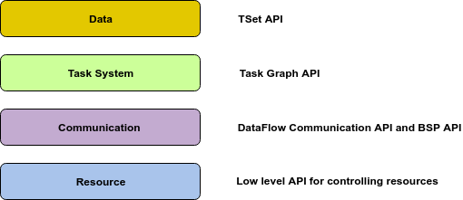

# Twister2 Overview

Twister2 provides set of layered components and APIs to build distributed data processing applications.

The lower APIs are harder to program and provides the best flexibility along with the highest performance.
The higher APIs are easier to program while not being not flexible and not as performant as lower APIs.

## Job Submission

In order to run a job on a distributed set of resources, the job submission layer does the following.

1. Acquire resources from a cluster resource manager
2. Distribute the job related material to the acquired resource
3. Spawn the set of processes to run the user code as well as manage the lifecycle of the job
4. Provide functions to discover the resources of the spawned processes (port numbers, ip addresses)
5. Provide additional functions for recovery, loggging, storage etc
6. Handle faults and recoveries

The Job Submission layer of Twister2 provides abstractions so that thse functions are available to higher layers as well as easily integrating resource managers.

It supports the following cluster resource managers.

1. Standalone
2. Kubernetes
3. Mesos
4. Nomad
5. Slurm

A more detailed description can be found in the presentations

[Twister2 Job Submission](https://docs.google.com/presentation/d/1Qs-eV9hTgyNRrDSvC5iCc2EmeUKQFtiVlTrTUZpsoAM/edit#slide=id.p1)

## Communication

Twister2 communication is responsible of performing optimized communications between workers.
It supports both batch and streaming communications. It also supports multiple communication
models like dataflow communication and bulk synchronuos parallel.

[Communication on Twister2](https://docs.google.com/presentation/d/1-rSL3SIFp03YgU8hTJcGMNdSJev8gQwhyTgS3FbYaqk/edit#slide=id.g4be91814d2_0_0)

## Task System

The task layer provides a higher-level abstraction on top of the communication layer to hide the details of execution
and communication from the user, while still delegating data management to the user. At this layer, computations are modeled as task graphs which
can be created either statically as a complete graph or dynamically as the application progresses. The task system comprises
of task graph, execution graph, and task scheduling process.

#### Task Graph

A node in the task graph represents a task while an edge represents a communication link between nodes. Each node in the graph holds information
about the inputs and its outputs (edges). Also, a node contains an executable user code. The user code in a task is executed when events arrive at the
inputs of the task. The user will output events to the output edges of the task graph and they will be sent through the network by the communication
layer. A task can be long-running or short-running depending on the type of application. For example, a stream graph will have long running tasks
while a dataflow graph without loops will have short running tasks. When loops are present, long-running tasks can be appropriate to reduce task
creation overheads.

#### Execution Graph

Execution graph is a transformation of the user-defined task graph, created by the framework for deploying on the cluster. This execution graph will
be scheduled onto the available resource by the task scheduler. For example, some user functions may run on a larger number of nodes depending on
the parallelism specified. Also, when creating the execution graph, the framework can perform optimizations on the user graph to increase efficiency
by reducing data movement and overlapping I/O and computations.

#### Task Scheduling

Task scheduling is the process of scheduling multiple task instances into the cluster resources. The task scheduling in Twister2 generates the task
schedule plan based on the per job policies, which places the task instances into the processes spawned by the resource scheduler. It aims to allocate
a number of dependent and independent tasks. Moreover, task scheduling requires different scheduling methods for the allocation of tasks
and resources based on the architectural characteristics. The selection of the best method is a major challenge in the big data processing environment.
The task scheduling algorithms are broadly classified into two types, namely static task scheduling algorithms and dynamic task scheduling
algorithms. Twister2 aims to support both types of task scheduling algorithms.

[Task System on Twister2](https://docs.google.com/presentation/d/1CpeBgKcM5NnIB0EdR0L5oWtfZdSG7kNlcEzyZPW8nuI/edit#slide=id.g4bf3440bc1_0_26)

## Important Links

Harp is a separate project and its documentation can be found in [website](https://dsc-spidal.github.io/harp/)

We use OpenMPI for HP communications [OpenMPI](https://www.open-mpi.org/)

Twister2 started as a research project at Indiana University [Digital Science Center](https://www.dsc.soic.indiana.edu/).

## License

Licensed under the Apache License, Version 2.0: http://www.apache.org/licenses/LICENSE-2.0

## Acknowledgements

This work was partially supported by NSF CIF21 DIBBS 1443054 and the Indiana University Precision Health initiative.

